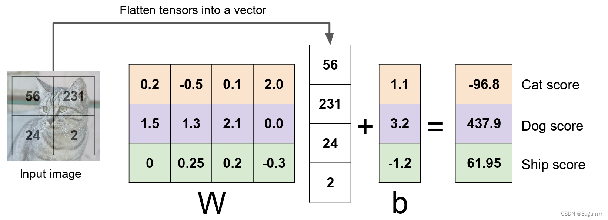
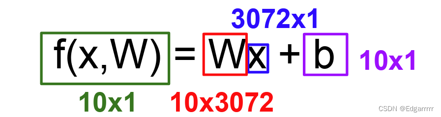
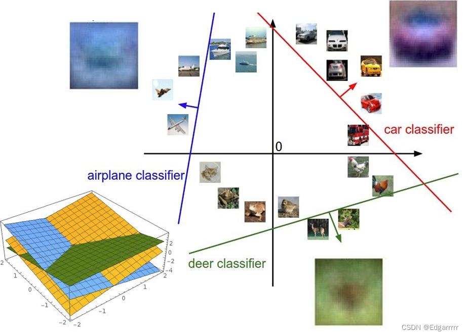
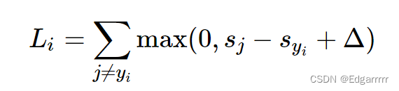
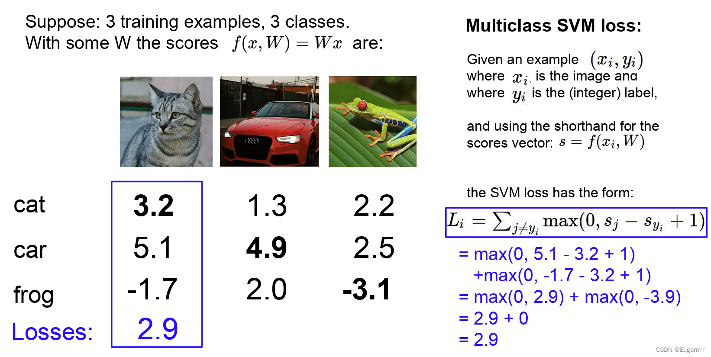
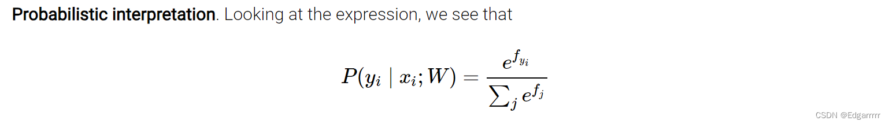
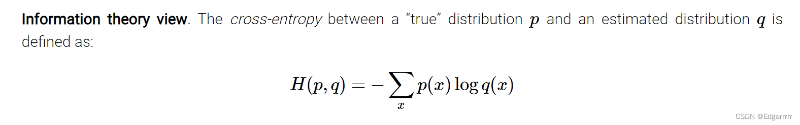
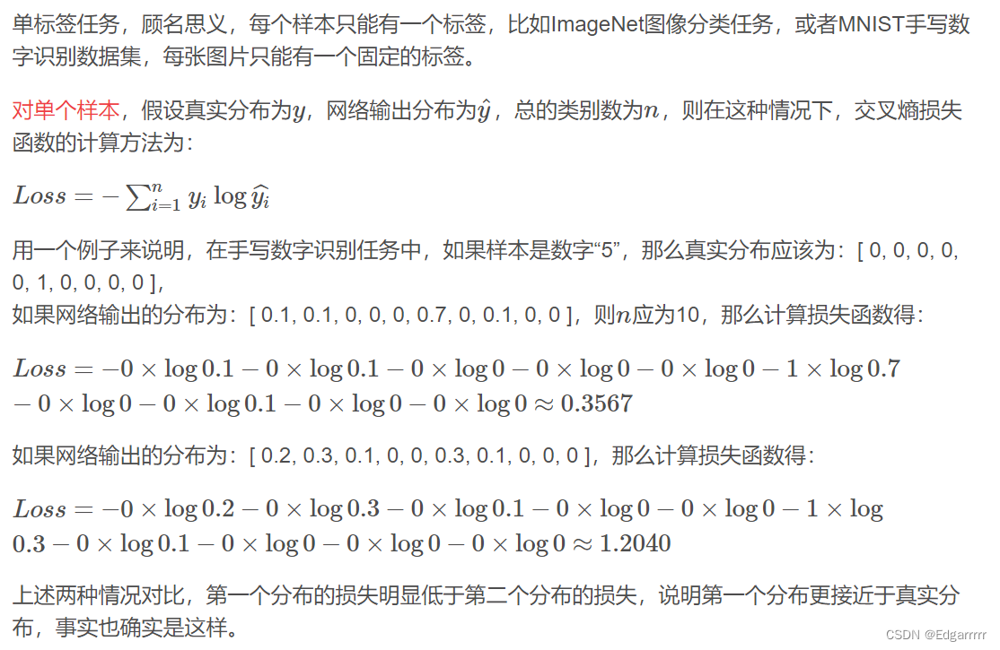
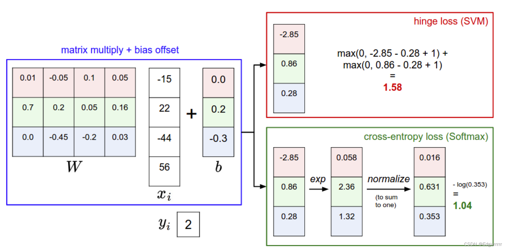

# Interpreting a linear classifier
+ 什么是线性分类器？
  
首先我们要知道的是，线性分类器也是可以应用于图片分类的一种方法。简单而言，线性分类器的本质是一种参数化方法（parametric approach）。将图片的pixel values 矩阵信息传入分类器中，基于分类器设置的参数矩阵W（可能会包含偏移向量b），通过线性运算，得到对于不同分类类别的评分。我们认为某一个类别标签的评分越高，则待分类的图像属于这个类别的标签的概率越大。所以我们会根据评分选择一个最可能的label，作为我们的预测结果。

那么问题来了，参数矩阵W具体是什么呢？接下来将从代数和几何角度来谈谈对linear classifier的理解.

+ 代数视角去理解线性分类器 
  

为简单起见，我们这里假设图像为一个灰度图像，则每一个像素点可以用一个【0，255】的整数来度量。如上图，我们用【56，231，24，2】来表示这个图像。根据分类器我们设置的W和b，我们能得到这张图片关于Cat，Dog，Ship三个类别的不同评分。不过根据我们之前对于线性分类器的基本介绍可以发现，这个预测并不好。本应该预测为Cat，可是Cat类别的分数仅仅有-96.8。远低于Dog和Ship类别。

以CIFAR-10数据集为例，这里给出计算公式：

+ 几何视角去理解线性分类器
  
由于我们将图像的value信息stretch成为一个高维空间的列向量，故我们可以将每个图像视作高维空间中的一个点。矩阵W的每一行是对某一个具体类别的classifier，故调整每一行的值的操作，可以认为是在高维空间中旋转分类超平面；而加入偏置向量，是为了使其可用性更广泛。可以认为W的每一行都确定了一个分类超平面的法向量。由于分类器是线性的，故从数值上来看，沿法向量方向上获得的预测分数会持续增加，同时在超平面上预测分数为0。

通过对linear classifier的基本介绍，我们可以发现参数矩阵W是最最最最为关键的，那么如何选取一个比较好的W呢？接下来我们就要来就此问题展开讨论。

# Loss function
+ The concept and function of Loss function
  
根据上文提出的评分函数，Loss function 告诉了我们目前的分类器优劣性如何，我们认为Loss function的值越小，则效果越好，反之分类器的效果越差。由此可以提供一个想法是从基础的分类问题转向一个优化问题。

+ Multiclass SVM loss
  
所谓SVM loss实际上其是希望：可以正确分类，且正确类别的得分至少比其他类别的得分高出$\Delta$（这里$\Delta$是一个hyper parameter）

其具体算某一个图片的loss（$L_{i}$）可以采用如下公式：其中y_{i}是图片对应的正确标签，$s_{j}$是第j个标签对应的分数。  

现在给出一个具体的例子：（此时的$\Delta$设置为1）

而总的损失我们可以算出每个图片的loss，最终求一个平均值来作为在此data set上的平均损失，而我们为了提高分类器的效果，实际上就是要极小化这个mean loss。从而在极小化loss的过程中更新score function中的W矩阵！

+ Softmax classifier 
  
 首先，总体而言，此softmax classifier是将二元Logistics回归泛化到多元分类的情况。其依旧是使用上述介绍的score  function。但是其输出的结果与SVM输出每个class 的得分并不一样，其输出的结果是每个类别对数回归归一化后的概率，i.e.softmax function的定义如下:

解释来说就是将评分取指数后，归一化的结果即为预测的概率值。

那么同样的我该如何去衡量此classifier的优劣呢？这就要引入Softmax classifier的loss function：cross-entropy loss（交叉熵损失）

+ Cross-entropy loss   
  

如上图，交叉熵实际上是来衡量预测分布与真实分布之间的差异度，而我们为了优化此classifier，则相当于去缩小这个loss。

举一个具体的例子

# SVM vs Softmax

下图展示了二者的差异主要是，SVM主要是对于不同类别给出得分，而Softmax是给出可能类别的概率。但二者在实际应用中差异并不大。

