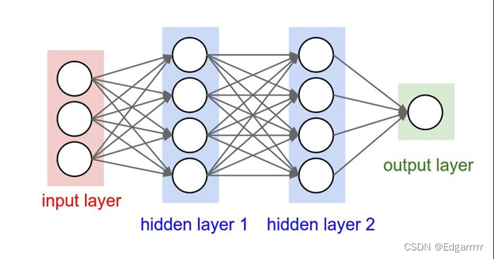
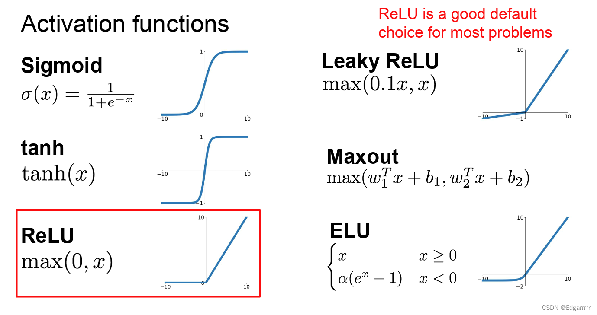
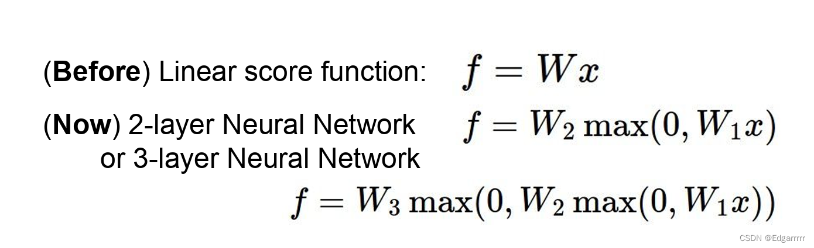

# The understanding of Neural Network

## Why we need Neural Network

为了去理解神经网络，我们首先要知道为什么需要神经网络。以分类问题为例子，有时仅仅通过线性分类器是无法达到我们的需求的，我们需要一些非线性的边界约束。这时神经网络就有了其出现的理由。

## The structure of Neural Network

以一个简单的三层全连接神经网络的结构为例子。我们先解释层数的定义，层数是指除了输入层之外的所有层之和。其次，神经网络结构，包括最后一层输出层，以及中间的隐藏层，和第一层输入层。

奥秘大多数集中在中间的隐藏层中，它也是为什么神经网络可以近似任何连续函数的原因。这是因为在隐藏层中，我们通过一些特殊的激活函数，使得其变得非线性起来。

### The activation function

上图是常见的激活函数，那么激活函数又是如何作用在隐藏层上的呢？我们现在来举一个例子：

通过此例子可以清晰的看出，在隐藏层之间，我们使用了max（a,b）的操作，i.e.ReLU这个激活函数，这使得原来的线性变换变成非线性的。同理，当我们继续增加隐藏层的数量，且使用更复杂的激活函数，我们可以去模拟任何的连续函数！

通过此例子可以清晰的看出，在隐藏层之间，我们使用了max（a,b）的操作，i.e.ReLU这个激活函数，这使得原来的线性变换变成非线性的。同理，当我们继续增加隐藏层的数量，且使用更复杂的激活函数，我们可以去模拟任何的连续函数！