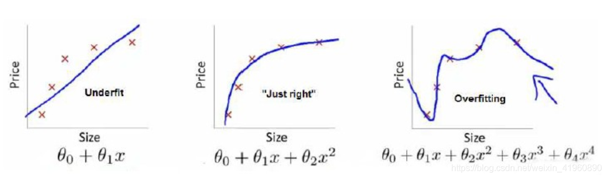
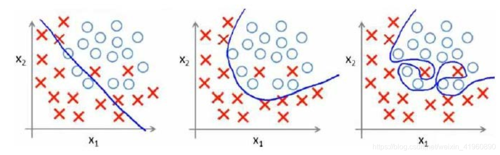
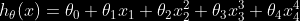
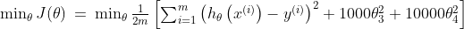
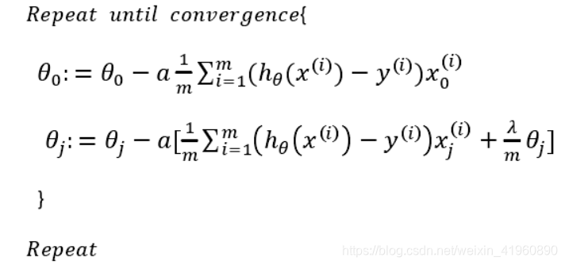
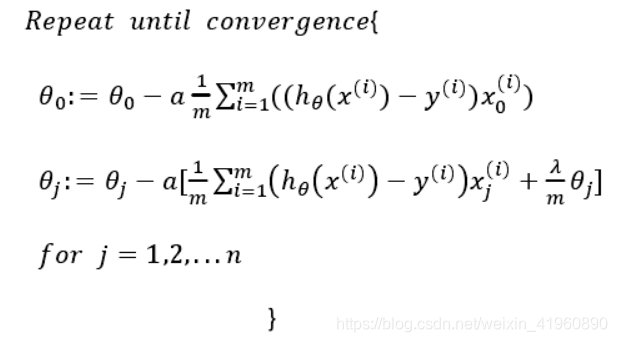
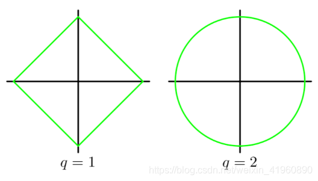
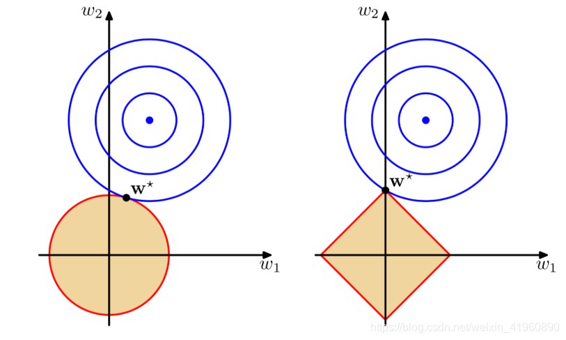

# 什么是正则化

Regularization，中文翻译过来可以称为正则化，或者是规范化。什么是规则？闭卷考试中不能查书，这就是规则，一个限制。同理，在这里，规则化就是说给损失函数加上一些限制，通过这种规则去规范他们再接下来的循环迭代中，不要自我膨胀。

# 为什么需要正则化

我们首先回顾一下模型训练的过程，模型参数的训练实际上就是一个不断迭代，寻找到一个方程 $H_{\theta}(x)$ 来拟合数据集。然而到这里，我们只知道需要去拟合训练集，但拟合的最佳程度我们并没有讨论过。看看下面回归模型的拟合程度，看看能发现什么。

最左边的图中，拟合程度比较低，显然这样的 $H_{\theta}(x)$ 并不是我们想求的。连训练集的准确率如此低，那么测试集肯定也不高，也就是模型的泛化能力不高。

最右边的图中，拟合程度非常高，甚至每一个点都能通过 $H_{\theta}(x)$ 表达，这个难道就是我们所渴望得到的 $H_{\theta}(x)$ 吗？并不是！我们的数据集中无法避免的存在着许多噪声，而在理想情况下，我们希望噪声对我们的模型训练的影响为0。而如果模型将训练集中每一个点都精准描述出来，显然包含了许许多多噪声点，在后续的测试集中得到的准确率也不高。另一方面，太过复杂的 $H_{\theta}(x)$ 直接导致函数形状并不平滑，而会像图中那样拐来拐去，并不能起到预测的作用，“回归”模型也丧失了其预测能力（也就是模型泛化能力），显然这也不是我们想要的。

中间的图中，展现的是最适合的拟合程度，$H_{\theta}(x)$ 不过于复杂或过于简单，并且能够直观的预测函数的走向。虽然它在测试集的中准确列不及图三高，但在测试集中我们得到的准确率是最高的，同时泛化能力也是最强的.

同样，在分类模型中也存在过拟合与欠拟合的情况.

## 总结一下：

+ 欠拟合：泛化能力差，训练样本集准确率低，测试样本集准确率低。
+ 过拟合：泛化能力差，训练样本集准确率高，测试样本集准确率低。
+ 合适的拟合程度：泛化能力强，训练样本集准确率高，测试样本集准确率高

## 欠拟合原因：

+ 训练样本数量少
+ 模型复杂度过低
+ 参数还未收敛就停止循环

## 欠拟合的解决办法：

+ 增加样本数量
+ 增加模型参数，提高模型复杂度
+ 增加循环次数
+ 查看是否是学习率过高导致模型无法收敛

## 过拟合原因：

+ 数据噪声太大
+ 特征太多
+ 模型太复杂

## 过拟合的解决办法：

+ 清洗数据
+ 减少模型参数，降低模型复杂度
+ 增加惩罚因子（正则化），保留所有的特征，但是减少参数的大小（magnitude）。

通过分析，我们可以看出，正则化是用来防止模型过拟合而采取的手段。我们对代价函数增加一个限制条件，限制其较高次的参数大小不能过大。还是使用回归模型举例子：

正是那些高次项导致了过拟合的产生，所以如果我们能让这些高次项的系数接近于0的话，我们就能很好的拟合了，因此，我们对代价函数 $J(\theta)$ 进行修改如下：

我们在方程中增加了两个限制条件，分别对 $\large \theta_{3}$ 和 $\large \theta_{4}$ 进行限制，不能让他们过高。很直观的看出，要想使 $J(\theta)$ 最小化，不仅仅需要 $h_{\theta}(x^{(i)})$ 足够拟合 $y^{(i)}$，同时还需要减少 $\large \theta_{3}$ 和 $\large \theta_{4}$。

一方面要使得L(w)的取值最小，必然w的绝对值会取到很大，这样模型才能完美拟合训练样本点；另一方面，当w的绝对值很大时，||w||的值又会变得很大，因此为了权衡，只有使得w取值适当，才能保证值取到最优。这样得到的拟合曲线平滑很多，因此具有泛化能力。这就是正则化存在的意义，能帮助我们在训练模型的过程中，防止模型过拟合。

# 怎么对模型做正则化

我们对前面的讨论进行推广。假如我们有非常多的特征，我们并不知道其中哪些特征我们要惩罚，我们将对所有的特征进行惩罚，并且让代价函数最优化的软件来选择这些惩罚的程度。于是，我们分析 线性回归模型 的代价函数和 Logistic回归模型 的代价函数如何修改。

## 线性回归

则修改梯度下降过程

## 逻辑回归

则修改对应梯度下降过程

其中$\lambda$ 称为正则化参数（Regularization Parameter），当参数越大，则对其惩罚（规范）的力度也就越大，越能起到规范的作用。但是要注意， $\lambda$并不是越大越好的！如果选择的正则化参数 $\lambda$ 大，则会把所有的参数都最小化了，导致模型变成 $H_{\theta}(x) = {\theta}_0$，造成欠拟合。因此，我们对 $\lambda$ 的选取需要合理即可。

# 不同的正则项

可能会有小伙伴提出疑问了，为什么正则项带了个平方呢？那我们来分析一下不同次方下的正则项。我们以一次和二次为例，正则项的图分别是一个矩形和圆形，如图：

那这有什么关系呢？我们把代价函数（包括正则项）整个画出来就知道了

可以直观的理解为，我们最小化损失函数就是求蓝圈+红圈的和的最小值，而这个值通在很多情况下是两个曲面相交的地方。

可以看到二次正则项的优势，处处可导，方便计算。

## L2 正则化

$\min_{W} \sum_{i=1}^{n} \sum_{j=1}^{m} \mathbb{I}\{W_{ij}\} + t \sum_{i=1}^{n} \|W_i\|_2^2$

式中，$\|w\|_{2}$ 为 $\omega$ 的2范式，平方是为了求解的方便。

L2正则化对于绝对值较大的权重予以很重的惩罚，对于绝对值很小的权重予以非常非常小的惩罚，当权重绝对值趋近于0时，基本不惩罚。这个性质与L2的平方项有关系，即越大的数，其平方越大，越小的数，比如小于1的数，其平方反而越小。

同时，他有另一个优势，在使用正规方程时，解析式中的逆始终存在的。

$\hat{W} = \left(X^TX + \lambda I \right)^{-1} X^T y$

## L1正则化

随着海量数据处理的兴起，工程上对于模型稀疏化的要求也随之出现了。这时候，L2正则化已经不能满足需求，因为它只是使得模型的参数值趋近于0，而不是等于0，这样就无法丢掉模型里的任何一个特征，因此无法做到稀疏化。这时，L1的作用随之显现。L1正则化的作用是使得大部分模型参数的值等于0，这样一来，当模型训练好后，这些权值等于0的特征可以省去，从而达到稀疏化的目的，也节省了存储的空间，因为在计算时，值为0的特征都可以不用存储了。

$\min_{W} \sum_{i=1}^{n} \sum_{j=1}^{m} \mathbb{I}\{W_{ij}\} + t \sum_{i=1}^{n} \|W_i\|_2^2$

式中，$\|w\|_{1}$ 为 $\omega$ 的1范式。

L1正则化对于所有权重予以同样的惩罚，也就是说，不管模型参数的大小，对它们都施加同等力度的惩罚，因此，较小的权重在被惩罚后，就会变成0。因此，在经过L1正则化后，大量模型参数的值变为0或趋近于0，当然也有一部分参数的值飙得很高。由于大量模型参数变为0，这些参数就不会出现在最终的模型中，因此达到了稀疏化的作用，这也说明了L1正则化自带特征选择的功能，这一点十分有用。

## L1正则化和L2正则化在实际应用中的比较

L1在确实需要稀疏化模型的场景下，才能发挥很好的作用并且效果远胜于L2。在模型特征个数远大于训练样本数的情况下，如果我们事先知道模型的特征中只有少量相关特征（即参数值不为0），并且相关特征的个数少于训练样本数，那么L1的效果远好于L2。然而，需要注意的是，当相关特征数远大于训练样本数时，无论是L1还是L2，都无法取得很好的效果。
