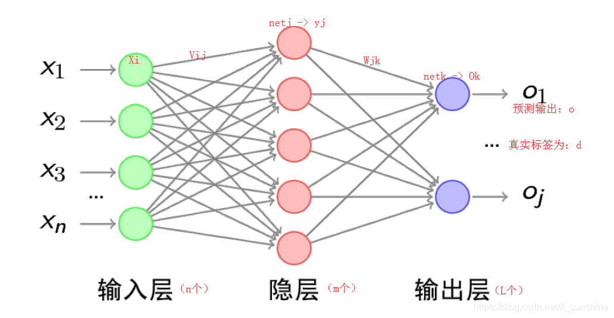
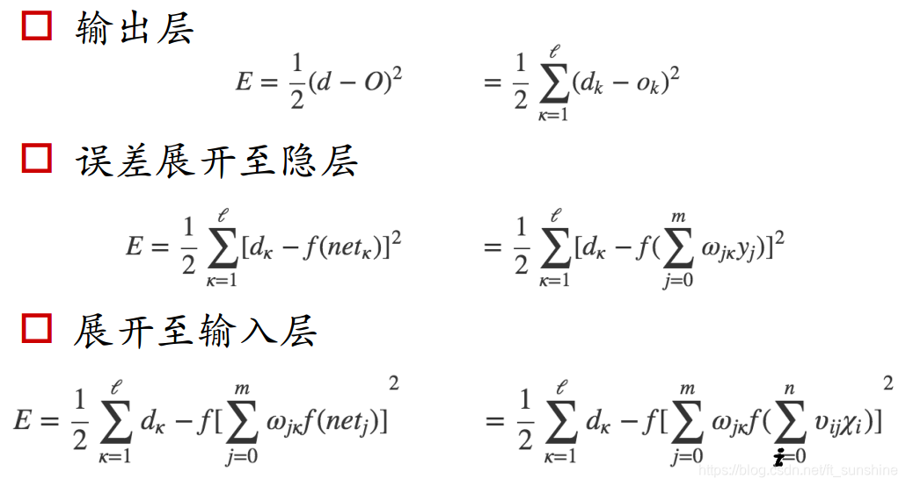
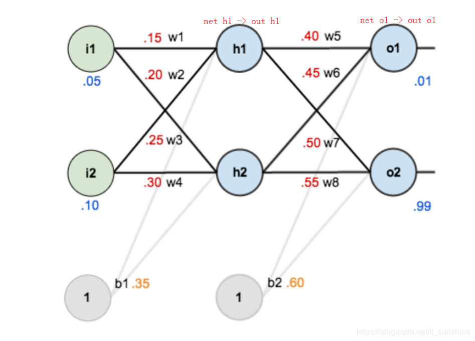
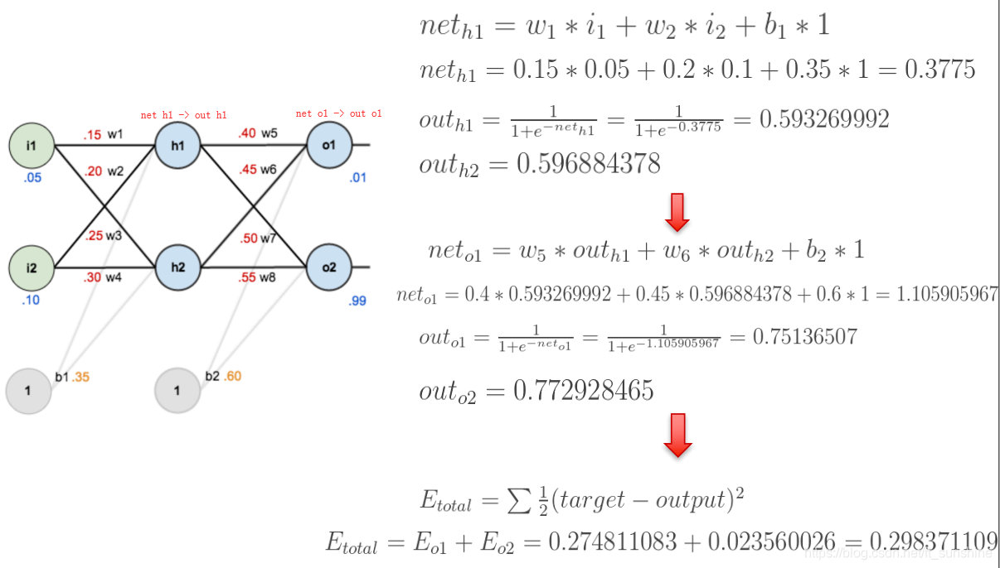
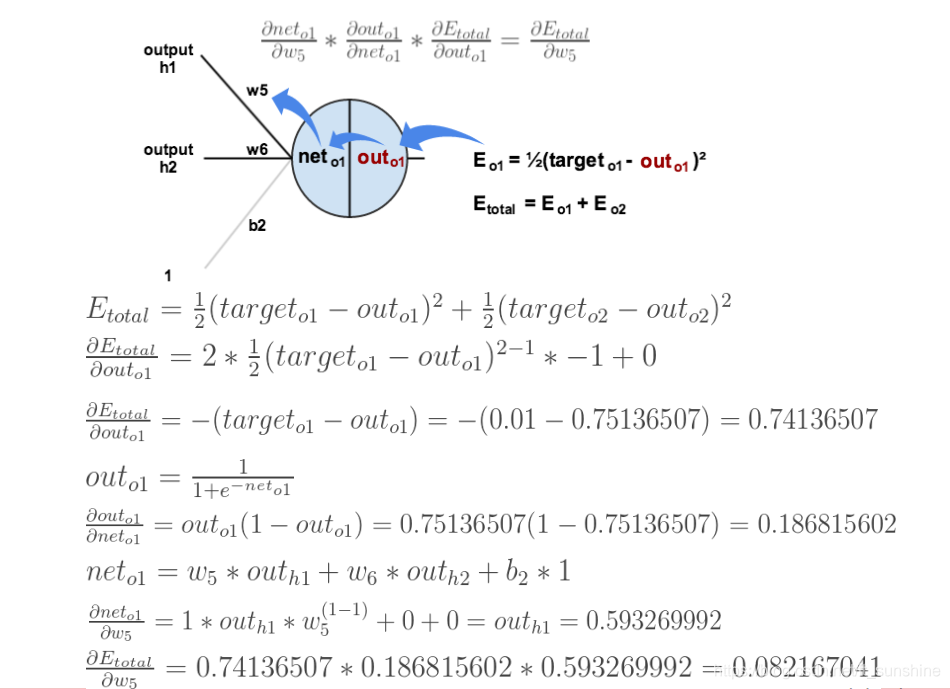
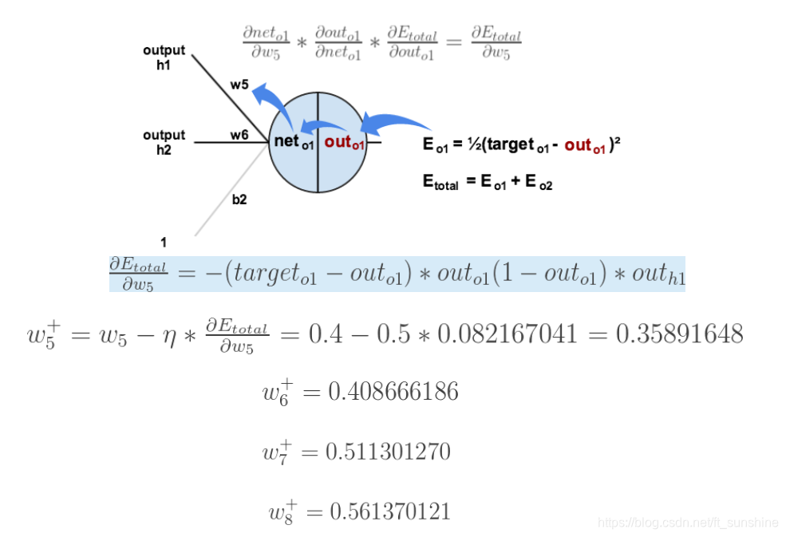
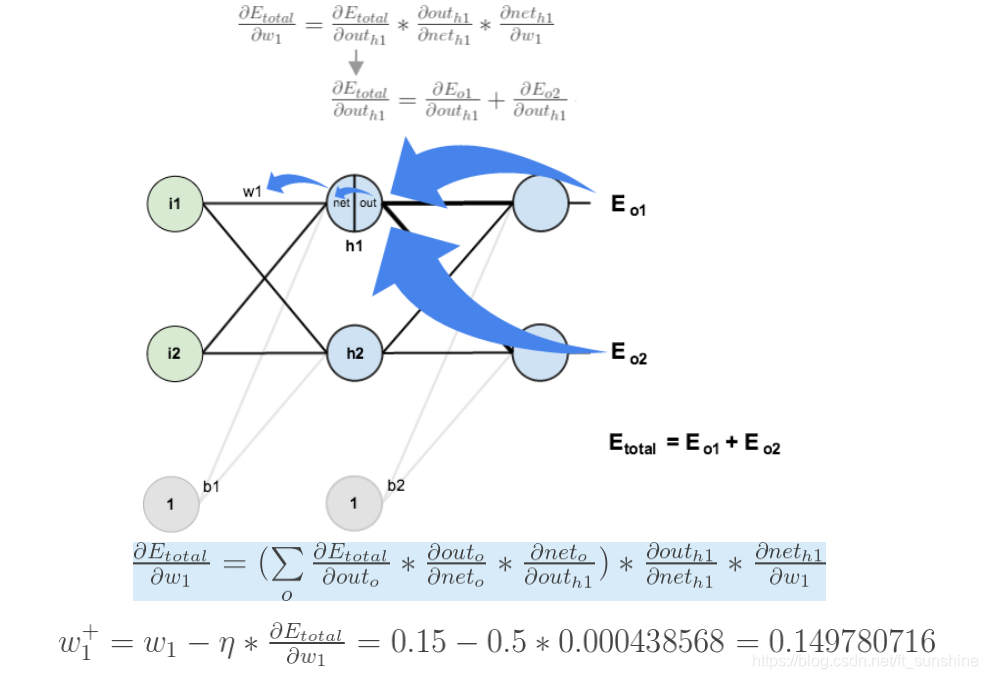

# 定义

反向传播（英语：Backpropagation，缩写为BP）是“误差反向传播”的简称，是一种与最优化方法（如梯度下降法）结合使用的，用来训练人工神经网络的常见方法。 该方法对网络中所有权重计算损失函数的梯度。 这个梯度会反馈给最优化方法，用来更新权值以最小化损失函数。（误差的反向传播）

# 算法讲解

BP算法，也叫$\delta$算法，下面以3层的感知机为例进行举例讲解。

上图的前向传播（网络输出计算）过程如下：（此处为网络的整个误差的计算，误差E计算方法为mse）

(上图有点小错误，无伤大雅)

上面的计算过程并不难，只要耐心一步步的拆开式子，逐渐分解即可。现在还有两个问题需要解决：

+ 误差E有了，怎么调整权重让误差不断减小
+ E是权重w的函数，何如找到使得函数值最小的w
  
解决上面问题的方法是梯度下降算法.

如图是一个简单的神经网络用来举例：

下面是前向（前馈）运算（激活函数为sigmoid）:

下面是反向传播（求网络误差对各个权重参数的梯度）：

我们先来求最简单的，求误差E对w5的导数。首先明确这是一个“链式求导”过程，要求误差E对w5的导数，需要先求误差E对out o1的导数，再求out o1对net o1的导数，最后再求net o1对w5的导数，经过这个链式法则，我们就可以求出误差E对w5的导数（偏导），如下图所示：

导数（梯度）已经计算出来了，下面就是反向传播与参数更新过程：

如果要想求误差E对w1的导数，误差E对w1的求导路径不止一条，这会稍微复杂一点，但换汤不换药，计算过程如下所示：

