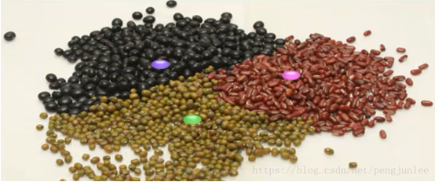
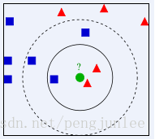
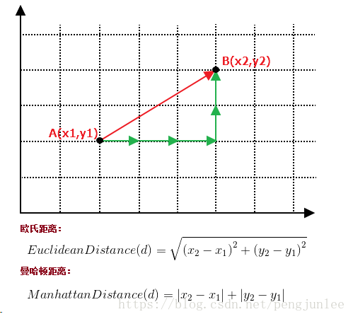

# KNN算法简介

KNN（K-Nearest Neighbor）最邻近分类算法是数据挖掘分类（classification）技术中最简单的算法之一，其指导思想是”近朱者赤，近墨者黑“，即由你的邻居来推断出你的类别

KNN最邻近分类算法的实现原理：为了判断未知样本的类别，以所有已知类别的样本作为参照，计算未知样本与所有已知样本的距离，从中选取与未知样本距离最近的K个已知样本，根据少数服从多数的投票法则（majority-voting），将未知样本与K个最邻近样本中所属类别占比较多的归为一类。

如下图所示，如何判断绿色圆应该属于哪一类，是属于红色三角形还是属于蓝色四方形？如果K=3，由于红色三角形所占比例为2/3，绿色圆将被判定为属于红色三角形那个类，如果K=5，由于蓝色四方形比例为3/5，因此绿色圆将被判定为属于蓝色四方形类。

# KNN算法的关键
(1) 样本的所有特征都要做可比较的量化

  若是样本特征中存在非数值的类型，必须采取手段将其量化为数值。例如样本特征中包含颜色，可通过将颜色转换为灰度值来实现距离计算。

(2) 样本特征要做归一化处理

   样本有多个参数，每一个参数都有自己的定义域和取值范围，他们对距离计算的影响不一样，如取值较大的影响力会盖过取值较小的参数。所以样本参数必须做一些 scale 处理，最简单的方式就是所有特征的数值都采取归一化处置

(3) 需要一个距离函数以计算两个样本之间的距离

通常使用的距离函数有：欧氏距离、余弦距离、汉明距离、曼哈顿距离等，一般选欧氏距离作为距离度量，但是这是只适用于连续变量。在文本分类这种非连续变量情况下，汉明距离可以用来作为度量。通常情况下，如果运用一些特殊的算法来计算度量的话，K近邻分类精度可显著提高，如运用大边缘最近邻法或者近邻成分分析法。

以计算二维空间中的A(x1,y1)、B(x2,y2)两点之间的距离为例，欧氏距离和曼哈顿距离的计算方法如下图所示：

(4) 确定K的值

K值选的太大易引起欠拟合，太小容易过拟合，需交叉验证确定K值。

# KNN算法的优点

+ 简单，易于理解，易于实现，无需估计参数，无需训练；
+ 适合对稀有事件进行分类；
+ 特别适合于多分类问题(multi-modal,对象具有多个类别标签)， kNN比SVM的表现要好。

# KNN算法的缺点

+ KNN算法在分类时有个主要的不足是，当样本不平衡时，如一个类的样本容量很大，而其他类样本容量很小时，有可能导致当输入一个新样本时，该样本的K个邻居中大容量类的样本占多数，如下图所示。该算法只计算最近的邻居样本，某一类的样本数量很大，那么或者这类样本并不接近目标样本，或者这类样本很靠近目标样本。无论怎样，数量并不能影响运行结果。可以采用权值的方法(和该样本距离小的邻居权值大)来改进
+ 该方法的另一个不足之处是计算量较大，因为对每一个待分类的文本都要计算它到全体已知样本的距离，才能求得它的K个最近邻点。
可理解性差，无法给出像决策树那样的规则。
