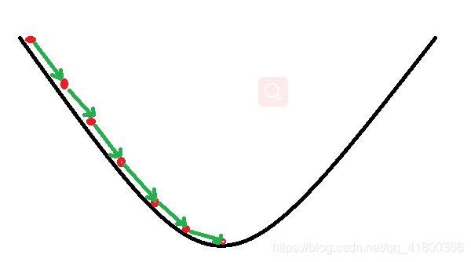
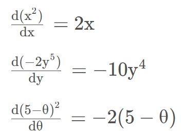
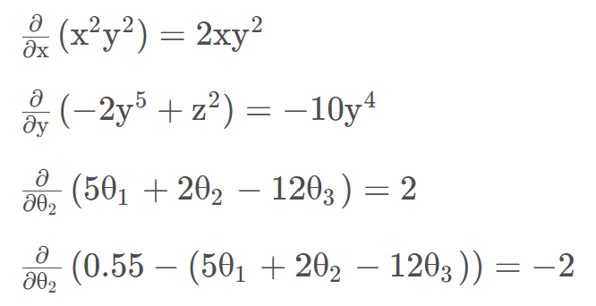
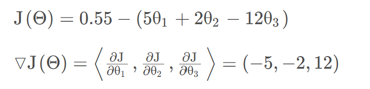
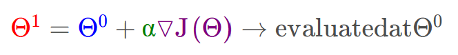
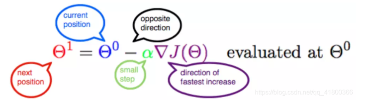
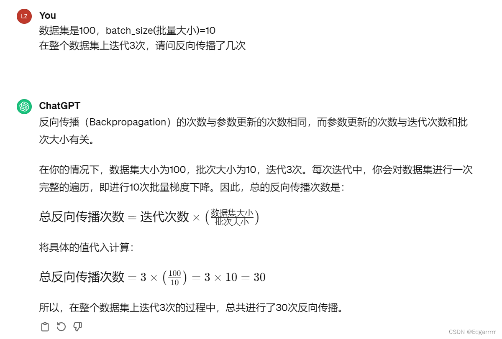

# Loss function and Optimization

我们知道loss function是可以反映模型训练好坏的一个标准，当然我们希望loss function越低越好，那么如何不断优化得到更优秀的W参数矩阵，来使loss function越低，训练效果越好呢？

## Optimization Strategy

### Random search

所谓Random search是指：我们既然想得到更好的W矩阵，最朴素最直接的想法就是去“暴力尝试”，随机产生不同的W矩阵，然后去保留loss function更小的W矩阵。

显然这种“漫无目的”的优化模式，并不能带来多大的优化效果。（在CIFAR-10测试集上只有15.5%的正确率）

### Random local search

与1.1.1相比，在Random local search中改进的是：我们不再暴力尝试很多矩阵，而是基于一个我们目前已经得到的矩阵W_0。在此W_0的基础上产生随机的一个扰动aW(这里a是一个常数，W是与W_0有相同结构的矩阵)

如若新矩阵W_0+aW会带来更小的loss，那我们则去更新原来的W,否则不去更新。（此方法相较于第一种有所改进，但是毕竟a与W很难去评估，我们在实际的正确率检验中也仅仅只有21.4%）

### Following the Gradient

前两个策略的关键都是在W矩阵空间中找到合适的方向，使得沿此方向调整我们可以降低损失函数的损失值。但是我们的方向可以直接根据损失函数来计算出来（我们这里认为损失函数处处可导，当然如不可导，我们可以用次梯度来代替要求的梯度）

## 梯度下降算法原理讲解

### 概述

梯度下降（gradient descent）在机器学习中应用十分的广泛，不论是在线性回归还是Logistic回归中，它的主要目的是通过迭代找到目标函数的最小值，或者收敛到最小值。
本文将从一个下山的场景开始，先提出梯度下降算法的基本思想，进而从数学上解释梯度下降算法的原理，解释为什么要用梯度，最后实现一个简单的梯度下降算法的实例！

### 梯度下降算法

####  场景假设

梯度下降法的基本思想可以类比为一个下山的过程。
假设这样一个场景：一个人被困在山上，需要从山上下来(找到山的最低点，也就是山谷)。但此时山上的浓雾很大，导致可视度很低；因此，下山的路径就无法确定，必须利用自己周围的信息一步一步地找到下山的路。这个时候，便可利用梯度下降算法来帮助自己下山。怎么做呢，首先以他当前的所处的位置为基准，寻找这个位置最陡峭的地方，然后朝着下降方向走一步，然后又继续以当前位置为基准，再找最陡峭的地方，再走直到最后到达最低处；同理上山也是如此，只是这时候就变成梯度上升算法了

#### 梯度下降

梯度下降的基本过程就和下山的场景很类似。

首先，我们有一个可微分的函数。这个函数就代表着一座山。我们的目标就是找到这个函数的最小值，也就是山底。根据之前的场景假设，最快的下山的方式就是找到当前位置最陡峭的方向，然后沿着此方向向下走，对应到函数中，就是找到给定点的梯度 ，然后朝着梯度相反的方向，就能让函数值下降的最快！因为梯度的方向就是函数之变化最快的方向(在后面会详细解释)
所以，我们重复利用这个方法，反复求取梯度，最后就能到达局部的最小值，这就类似于我们下山的过程。而求取梯度就确定了最陡峭的方向，也就是场景中测量方向的手段。那么为什么梯度的方向就是最陡峭的方向呢？接下来，我们从微分开始讲起：

##### 微分

看待微分的意义，可以有不同的角度，最常用的两种是：

+ 函数图像中，某点的切线的斜率
+ 函数的变化率

几个微分的例子：

1.单变量的微分，函数只有一个变量时

2.多变量的微分，当函数有多个变量的时候，即分别对每个变量进行求微分

##### 梯度

梯度实际上就是多变量微分的一般化。
下面这个例子：

我们可以看到，梯度就是分别对每个变量进行微分，然后用逗号分割开，梯度是用<>包括起来，说明梯度其实一个向量。

梯度是微积分中一个很重要的概念，之前提到过梯度的意义

+ 在单变量的函数中，梯度其实就是函数的微分，代表着函数在某个给定点的切线的斜率
+ 在多变量函数中，梯度是一个向量，向量有方向，梯度的方向就指出了函数在给定点的上升最快的方向

这也就说明了为什么我们需要千方百计的求取梯度！我们需要到达山底，就需要在每一步观测到此时最陡峭的地方，梯度就恰巧告诉了我们这个方向。梯度的方向是函数在给定点上升最快的方向，那么梯度的反方向就是函数在给定点下降最快的方向，这正是我们所需要的。所以我们只要沿着梯度的方向一直走，就能走到局部的最低点！

#### 数学解释

首先给出数学公式：

此公式的意义是：J是关于Θ的一个函数，我们当前所处的位置为Θ0点，要从这个点走到J的最小值点，也就是山底。首先我们先确定前进的方向，也就是梯度的反向，然后走一段距离的步长，也就是α，走完这个段步长，就到达了Θ1这个点！

#####  α

α在梯度下降算法中被称作为学习率或者步长，意味着我们可以通过α来控制每一步走的距离，以保证不要步子跨的太大扯着蛋，哈哈，其实就是不要走太快，错过了最低点。同时也要保证不要走的太慢，导致太阳下山了，还没有走到山下。所以α的选择在梯度下降法中往往是很重要的！α不能太大也不能太小，太小的话，可能导致迟迟走不到最低点，太大的话，会导致错过最低点！

##### 梯度要乘以一个负号

梯度前加一个负号，就意味着朝着梯度相反的方向前进！我们在前文提到，梯度的方向实际就是函数在此点上升最快的方向！而我们需要朝着下降最快的方向走，自然就是负的梯度的方向，所以此处需要加上负号；那么如果时上坡，也就是梯度上升算法，当然就不需要添加负号了。

## Gradient Descent（the main way of optimization）

这里主要介绍我们常用的一种训练方法——小批量梯度下降（Mini-batch gradient descent），这里与反向传播算法联系紧密！！

所谓小批量梯度下降，是在对整个训练集迭代一次的时候，将训练集划分为多个batch，每训练一个batch，我们就进行一次反向传播（详情见2.2）去更新参数。

这样我们就可以实现更快速的收敛，并以此来进行更频繁的参数更新。

举一个具体的例子（利用gpt）：

